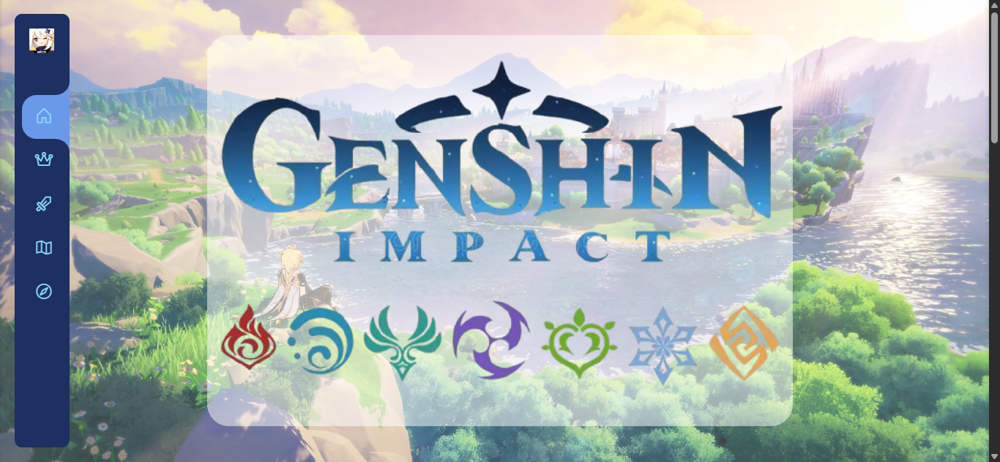
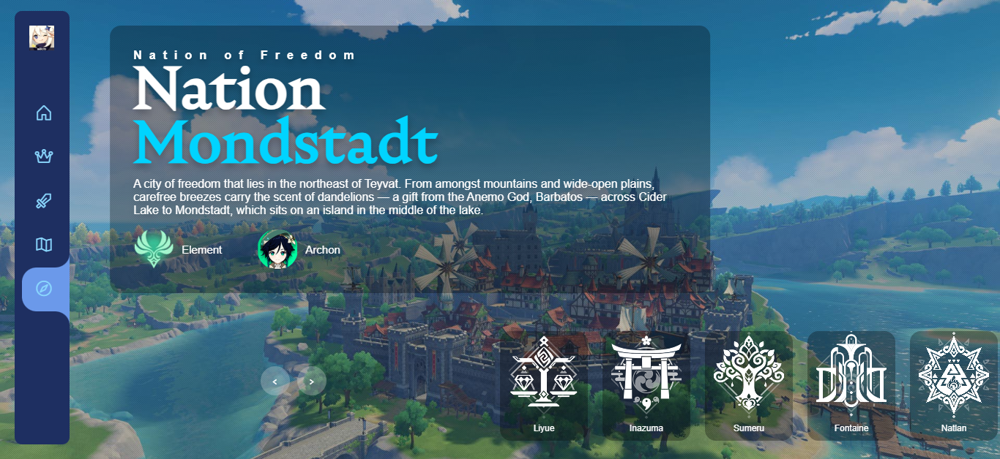

#  ⚔️💫 Genshin Impact Tribute Website
This is a triute website for the game [Genshin Impact](https://genshin.hoyoverse.com/en/home) by [HoyoVerse](https://www.hoyoverse.com/en-us/). My siblings really like this game, so I thought it would make for a cool project!

here's my favourite genshin quote:
> IS THIS WHAT JUSTICE MEANS TO YOU? ANSWER ME, NEUVILLETTE!
> 
> ~ Vautrin (Neuvillette's Story Quest)

## Live Demo
[https://pari55051.github.io/genshin-impact-website/](https://pari55051.github.io/genshin-impact-website/)

P.S   I am really proud of the 'Nations' page, do check it out!

## Pages
--> Home page

--> Top Characters Page (divided by type of character)

--> Weapons Page (all weapon types in Genshin, with 5 examples)

--> Teyvat's Map

--> Nations Page (best one in all of website :D )

## Images

## Learnings
- a lot of new JS concepts
- a lot of teeny details of CSS properties
- structuring and executing a large project(max no. pages + content that i've ever built)
- patience (this took ~29 hours of code + ~3+ hours of finding/editing assets)

## Challenges Faced
- debugging the 'Nations' page (why did you have so many problems???)
- styling the website (managing a lot of arguments for the styles, since my siblings didn't like half the stuff i did and then i had to redo it) (also, considering that i'm the only one who doesn't play this game (high school senior + tech hobbies = no time for casual gaming), this was difficult)
- debugging the sidebar js took way more time than i'd like to admit
- finding time to complete it (hackclub's YSWS are very tempting (and distracting ;D))

## Credits
- made by: [U. N. Owen](https://github.com/pari55051)

- assets: google, [Genshin Impact Official Website(s)](https://genshin.hoyoverse.com/en/home?utm_source=fab&utm_medium=home), [Genshin Wiki](https://genshin-impact.fandom.com/wiki/Genshin_Impact_Wiki)
- fonts: [Nocturne](https://github.com/warszawskie-kroje/nocturne/tree/maste), [Violet Sans](https://github.com/violetoffice/violet_sans), [Playfair Display](https://fonts.google.com/specimen/Playfair+Display)
- icons: [Phosphor Icons](https://phosphoricons.com/)
- siblings: for the un-needed(kinda needed though) style guide
